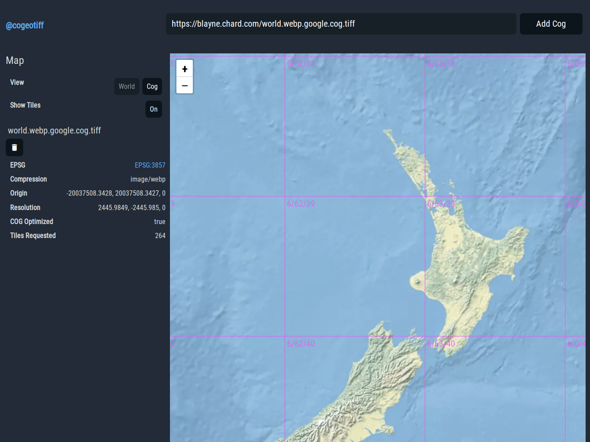

# @cogeotiff/web

Example web interface using leaflet and [@cogeotiff](https://github.com/blacha/cogeotiff) to render cogs directly




## Developing

To run this locally the following commands can be used

```bash
yarn # install deps

yarn build # build the typescript into javascript

yarn bundle # use esbuild to make a single dist/index.js

serve . # Use a http server to serve index.html + dist/index.js

open localhost:3000
```
